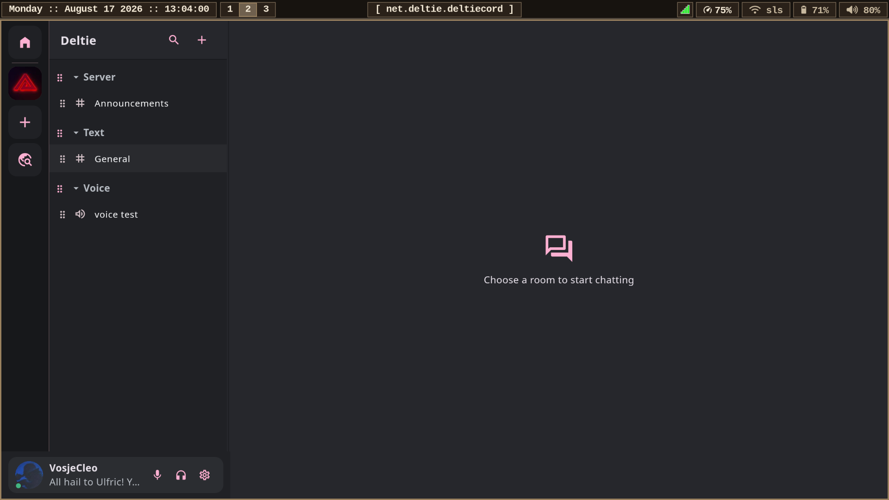

# Known issues

## v0.9.24 build 76 prerelease notes

- Fixed in build 76: poll response maps are tallied by voter as defined by the
  Matrix SDK, so disclosed poll counts and the current user's choice update.
- Fixed in build 76: the active timeline no longer replaces both ends of a
  sliding 120-event presentation window. It keeps stable event identities in
  one lazy list while paging older/newer history, preventing the post-eviction
  scroll trap.
- Fixed in build 76: Android hold-to-send-later owns the long-press gesture and
  opens the date/time picker instead of allowing a tooltip to consume it.
- Fixed in build 76: mobile general and per-Space profile editors use the full
  root viewport. Per-Space profiles share the general editor and expose reset
  controls for every inherited field.
- Fixed in build 76: desktop activity publication waits for the own profile to
  hydrate, preventing early presence updates from erasing an existing status.
- Hardened in build 76: Android notification resolution requires network,
  retries bounded transient failures with exponential backoff, and reports its
  last worker result in Settings. Delivery still depends on the selected
  UnifiedPush distributor being exempt from vendor battery restrictions.
- Changed in build 76: automatic startup update prompts follow Stable only.
  The explicit About-page update check continues to report Latest builds.

- Scheduled messages are stored privately on the originating device and use
  the normal encrypted send path while Deltiecord is connected. Android does
  not yet keep a permanent background scheduler alive; an overdue message is
  sent after the next connected launch.
- Device verification can start a Matrix SAS verification request and exposes
  current trust/cross-signing state, but Deltiecord's complete interactive SAS
  comparison/confirmation surface is not finished. Use another established
  Matrix client when a verification flow requires UI that Deltiecord does not
  yet show.
- The unified inbox resolves room invitations, mentions, replies, and reactions
  from locally available history. Complete missed-call history needs a
  dedicated indexed activity store and is not claimed in this build.
- Moderation timeouts use standard Matrix power levels plus a documented
  Deltiecord restoration state because Matrix has no standard timeout event.
  If a room permits power-level changes but denies writes to the restoration
  state, the initiating client must remain online to restore the previous
  level automatically.
- Sticker pack discovery supports the established FluffyChat-compatible
  `im.ponies.*_emotes` formats. Pack authoring/import UI is not included yet.

## Fixed in v0.9.20 build 66

- Timeline pages are de-duplicated by Matrix event ID, repeated pagination tokens are exhausted, and mobile history changes preserve a stable visible event anchor.
- Mobile timelines restore calendar-day separators, dated historical timestamps, and message grouping across receipt/edit metadata updates.
- Attached media now exposes the same safe copy/save/open/fullscreen actions on mobile, and close controls no longer depend on a missing icon glyph.
- Embedded images and videos use the inline-media bounds; tapping embedded media opens the in-client viewer while the explicit link opens the website.
- Copy text is available directly from desktop right-click and Android long-press message actions.
- Deltiecord performs one bounded automatic update check after startup.
- UnifiedPush now follows the asynchronous distributor lifecycle used by established Matrix clients, reconciles endpoint rotation, and registers privacy-preserving `event_id_only` pushers.
- Android notifications resolve cached sender avatars for DMs and Space avatars for Space-room notifications when available.

### Bugs
Universal:
- Fixed in v0.9.19: After first login, the user panel now hydrates status, avatar, and profile metadata.
- Fixed in v0.9.19: The app logo artwork was repositioned for desktop launchers.
- Fixed in v0.9.19: Rich image/text previews recover from failed server previews; opt-in embedded video candidates are validated before playback.
- Fixed in v0.9.19: Settings hide operating-system-specific controls on other platforms.
  
Desktop Specific:
- Fixed in v0.9.19: Edited messages use their current replacement content in replies.
- Fixed in v0.9.19: Room and category drag grips share the same geometry.

- Fixed in v0.9.19: Channel drag/drop is disabled by default behind an Appearance toggle.
  
Mobile Specific:
- Fixed in v0.9.19: Microphone Test owns and releases its native WebRTC session safely.
- Fixed in v0.9.19: Android adaptive and notification icons no longer add the old white plate.
- Fixed in v0.9.19: Profile action spacing is unified.
- Fixed in v0.9.19: Notification settings expose the UnifiedPush distributor/registration controls.
- Fixed in v0.9.19: Mobile settings pages transition as separate clipped panels.
- Fixed in v0.9.19: Rooms navigation no longer retains the oversized bottom safe-area padding.
- Fixed in v0.9.19: Edited messages render their current replacement content.
- Fixed in v0.9.19: Space avatars fill their squircle frame.
- Fixed in v0.9.19: Timeline avatars keep a square constraint and circular crop.
- Fixed in v0.9.19: Timeline avatar and message gutters use equal spacing.
- Addressed in v0.9.19: Release CI requires one persistent signing identity. Builds signed by an older ephemeral key still require one uninstall before the first stable-signed upgrade.
- Fixed in v0.9.19: Long-pressing a Space opens its management actions.

### Features queued
- Implemented in v0.9.19: Manual release/update checking from About.
- Implemented in v0.9.19: Android Space settings include channel/category management and ordering.
